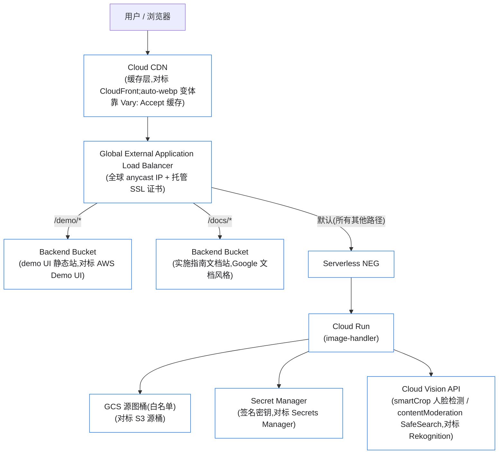

# Dynamic Image Transformation for Google Cloud CDN — 设计稿 v1

> 对标 AWS Solutions "Dynamic Image Transformation for Amazon CloudFront"(v7 Lambda serverless 架构)。
> 目标:AWS 迁移客户**无缝使用**——URL 格式、请求 JSON schema、Thumbor filter、签名算法、错误码逐一兼容。
> 状态:待用户确认后开发。

## 1. 架构总览



## 2. AWS → GCP 服务映射

| AWS(v7 Lambda 架构) | GCP 对标 | 说明 |
|---|---|---|
| CloudFront | Cloud CDN + Global External ALB | 缓存 TTL 遵循源站 Cache-Control,negative caching 4xx=10s/5xx=600s |
| CloudFront Function(请求归一化) | Cloud Run 入口中间件 | Accept 头归一化为 `image/webp`/空、query 白名单过滤+排序;CDN 侧禁止 Accept 进缓存键,改由服务端 `Vary: Accept`(Cloud CDN 原生支持)区分变体 |
| API Gateway + Lambda (Node.js + sharp) | Cloud Run(Node.js 22 + sharp,TypeScript) | 1 vCPU / 1GiB,min-instances=0,concurrency 适中;保留 AWS 6MB/413 行为为可选兼容开关 |
| S3 源桶 | GCS 源桶(SOURCE_BUCKETS 白名单) | Thumbor 路径同时接受 `s3:<bucket>/` 与 `gs:<bucket>/` 前缀;可选 BUCKET_MAP 做 S3→GCS 桶名别名映射(迁移利器) |
| Secrets Manager | Secret Manager | 同样存 JSON,`SECRET_KEY` 取键;签名算法逐字节一致(HMAC-SHA256 hex) |
| Rekognition DetectFaces | Vision API FACE_DETECTION | bbox 换算成归一化坐标后套用 AWS 同款 clamp/padding 逻辑;人脸按面积降序排序保证 faceIndex 确定性 |
| Rekognition DetectModerationLabels | Vision API SAFE_SEARCH_DETECTION | likelihood(1-5)映射 minConfidence(0-100);adult/violence/racy 等映射 moderationLabels |
| CloudWatch Logs/Dashboard | Cloud Logging + Monitoring | 结构化日志含 requestId;dashboard JSON 附上(需可选权限) |
| CloudFormation 一键部署 | **Launch Wizard**:Open-in-Cloud-Shell 交互式向导 | 交互收集参数(对标 CFN 参数表)→ 内部驱动 Terraform,保证与方式二产物一致 |
| CDK 源码部署 | **Terraform** 模块(`infra/terraform/`) | 输入变量一一对标 CFN 参数;`terraform apply` 直接以 VM SA 的 ADC 运行 |

## 3. API 兼容性承诺(核心)

三种请求类型判定顺序、行为与 AWS 源码一致:

1. **DEFAULT**:`/<base64(JSON)>`,JSON schema `{bucket?, key, edits?, outputFormat?, effort?, headers?}`;bucket 必须在白名单,否则 403 `ImageBucket::CannotAccessBucket`
2. **CUSTOM**:`REWRITE_MATCH_PATTERN`/`REWRITE_SUBSTITUTION` 重写后走 Thumbor 解析
3. **THUMBOR**:`/[fit-in/][AxB:CxD/][WxH/][filters:...]key`,20 个 filter 全量实现(autojpg/background_color/blur/convolution/equalize/fill/format/grayscale/no_upscale/proportion/quality/rgb/rotate/sharpen/stretch/strip_exif/strip_icc/upscale/watermark/animated/smart_crop)

同步兼容:
- **edits 白名单**:sharp 直通全集(channel/color/operation/format/resize 五组)+ 特殊操作(overlayWith、smartCrop、roundCrop、contentModeration、crop、animated)
- **query param edits**:`format/fit/width/height/rotate/flip/flop/grayscale` 叠加覆盖
- **签名**:`?signature=` HMAC-SHA256(hex),待签串 = path[?排序后query],密钥在 Secret Manager JSON;错误码 400 `AuthorizationQueryParametersError` / 403 `SignatureDoesNotMatch` 一致
- **expires**:`YYYYMMDDTHHmmssZ`,过期 400 `ImageRequestExpired`,命中后 Cache-Control 重写
- **错误 JSON**:`{"status":n,"code":"...","message":"..."}` 与 AWS 逐字段一致(含 404 NoSuchKey 文案)
- **fallback image**、**AUTO_WEBP**(Accept 头)、**HEADER_DENY_LIST**、Content-Type 魔数推断、`Expires`/`Last-Modified` 透传:全部照搬
- 环境变量名沿用 AWS(SOURCE_BUCKETS、CORS_ENABLED、AUTO_WEBP、ENABLE_SIGNATURE、SECRETS_MANAGER、SECRET_KEY、ENABLE_DEFAULT_FALLBACK_IMAGE、DEFAULT_FALLBACK_IMAGE_BUCKET/KEY、REWRITE_*、SHARP_SIZE_LIMIT),降低迁移心智

差异点(均为放宽或可选,文档中明示):
- Cloud Run 无 6MB 响应/29s 超时硬限 → 默认放宽;`COMPAT_AWS_LIMITS=Yes` 可复刻 413 行为
- `s3:` 桶前缀继续支持,同时新增 `gs:`;`BUCKET_MAP` 支持旧 S3 桶名→GCS 桶名映射
- smartCrop 人脸排序:Vision 无 Rekognition 同款排序,统一按 bbox 面积降序(文档注明)

## 4. 仓库结构(~/dynamic-image-transformation-gcp)

```
├── source/
│   ├── image-handler/            # TypeScript + sharp + express,结构对标 AWS
│   │   ├── src/{index,image-request,image-handler,thumbor-mapper,query-param-mapper,
│   │   │        request-normalizer,secret-provider,vision-client,lib/*}.ts
│   │   ├── test/                 # Jest,镜像 AWS 的测试目录:image-handler/ image-request/
│   │   │                         #   thumbor-mapper/ request-normalizer/ + 测试图片素材
│   │   ├── Dockerfile            # node:22-slim,Cloud Build 构建
│   │   └── package.json / tsconfig.json / jest.config.js
│   ├── demo-ui/                  # 静态 demo UI(对标 AWS Demo UI:选桶选图→调参→预览→给出 JSON+base64 URL)
│   └── docs-site/                # 客户文档站(Google 文档风格静态站,目录对标 AWS 实施指南)
├── infra/
│   ├── terraform/                # 方式二:模块化 TF(cloud-run / lb-cdn / buckets / secret / iam)
│   └── launch-wizard/            # 方式一:launch-wizard.sh 交互向导(Open in Cloud Shell)
├── deployment/
│   ├── run-unit-tests.sh         # 对标 AWS 同名脚本
│   ├── build-and-deploy.sh       # Cloud Build 构建镜像 + terraform apply
│   └── run-e2e-tests.sh          # 对已部署端点跑 e2e(真实 GCS 图片、签名、webp、Vision)
├── docs/                         # 文档站 markdown 源(构建产物进 docs-site)
├── DESIGN.md / README.md / CHANGELOG.md / LICENSE (Apache-2.0)
└── storyline-run.md              # 交付后场景演练手册
```

## 5. 测试策略

- **单元测试**:Jest 29 + ts-jest,测试文件组织镜像 AWS(image-handler 15 类 / image-request 15 类 / thumbor-mapper 6 类 / normalizer),GCS/Vision/Secret Manager 全 mock;目标行覆盖 ≥80%
- **本地集成**:supertest 起 express,走真实 sharp 管线 + mock 存储
- **e2e(真实环境)**:部署到 helloworld-334009 后,脚本对公网端点断言:resize/format/quality/watermark/smart_crop/moderation/签名正误/expires/fallback/404/CORS/auto-webp/CDN 缓存命中(第二次请求 Age 头)
- 部署验证:`terraform plan`(dry-run)→ `apply` → e2e 全绿 → 输出报告

## 6. 部署产物与资源命名(helloworld-334009, asia-southeast1)

前缀 `dit-`:Cloud Run `dit-image-handler`、Artifact Registry `dit`、桶 `helloworld-334009-dit-{source,demo,docs,logs}`、Secret `dit-signature-secret`、LB `dit-lb`(全局 IP + 托管证书,域名待定)。

## 7. 权限清单

已具备(实测 testIamPermissions 全绿):Cloud Run 建/改/公开、Cloud Build、Artifact Registry、GCS 桶建/IAM、Secret Manager 建/读/IAM、LB/CDN 全套 compute 权限、SA actAs、Vision API 调用、服务启用。

可选(缺失,不阻塞,建议给):
| 权限/角色 | 用途 | 授权命令(你在有权限的账号下跑) |
|---|---|---|
| `roles/iam.serviceAccountAdmin`(或手工建) | 为 Cloud Run 建专属最小权限 SA(否则用默认 compute SA) | `gcloud iam service-accounts create dit-runtime && gcloud projects add-iam-policy-binding ...` |
| `roles/resourcemanager.projectIamAdmin` | Terraform 管理项目级 IAM 绑定(现用资源级 IAM 绕开) | `gcloud projects add-iam-policy-binding helloworld-334009 --member=serviceAccount:673474574447-compute@developer.gserviceaccount.com --role=roles/resourcemanager.projectIamAdmin` |
| `roles/monitoring.editor` | 创建运维 Dashboard(对标 CloudWatch dashboard) | 同上,role 换 `roles/monitoring.editor` |
| `roles/dns.admin`(若 zone 在本项目) | 自动写域名 A 记录(否则你手工加) | 同上,role 换 `roles/dns.admin` |

## 8. 成本量级(对标 AWS 成本页,细表进文档站)

10M 张/月、90% 缓存命中、45KB 均图:Cloud CDN 出流量占大头(≈$0.09-0.14/GB APAC),Cloud Run+Vision+GCS 为小头;LB 转发规则固定 ≈$18/月。文档站将给 10M/125M/500M 三档对标测算表。

## 9. 交付顺序

1. repo 骨架 + image-handler 核心(三种请求解析 + edits 管线)+ 单元测试
2. 签名/expires/fallback/Vision 集成 + 单元测试补全
3. Terraform 模块 + Cloud Build;dry-run(plan)后真实部署到你的项目
4. Launch Wizard 向导脚本(复用 TF)
5. demo UI + 文档站(Google 风格)上线到同一 LB
6. e2e 全量跑通 → storyline-run.md 场景手册 → 交付确认
