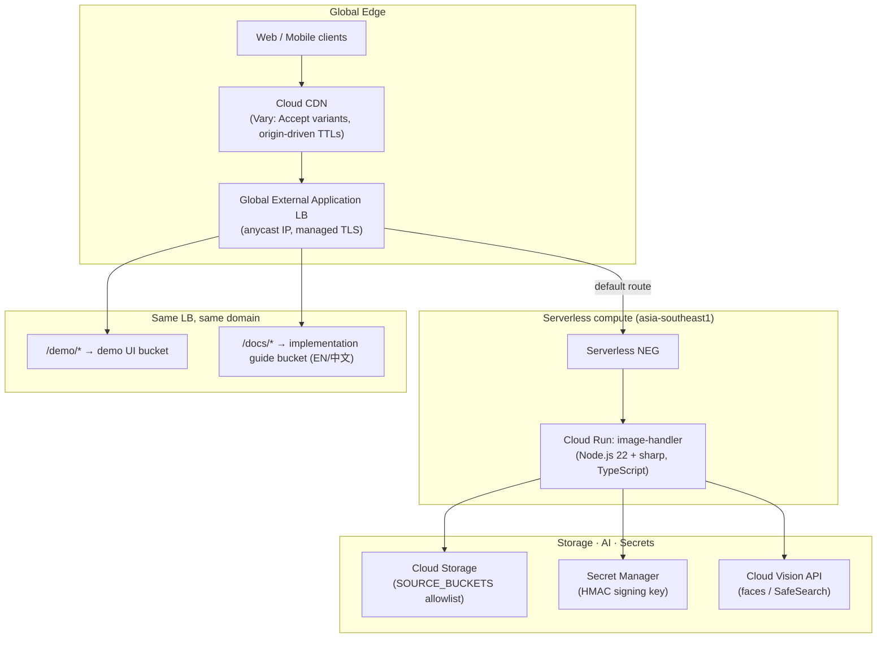

# Dynamic Image Transformation for Google Cloud CDN

[🇨🇳 中文文档 (Chinese)](./README_zh.md) | **🇺🇸 English Documentation**

[](https://cloud.google.com/run)
[](https://nodejs.org)
[](https://github.com/aws-solutions/dynamic-image-transformation-for-amazon-cloudfront)
[](./source/image-handler/test)
[](./source/image-handler/jest.config.js)

> **A drop-in Google Cloud port of the AWS Solution "Dynamic Image Transformation for Amazon CloudFront" (v7 serverless architecture, formerly Serverless Image Handler).**
> URL formats, the base64-encoded JSON request schema, all 20 Thumbor filters, HMAC request signing, error JSON bodies and response headers are **field-for-field compatible** with AWS — clients migrating from CloudFront keep working with **zero code changes**, while gaining Cloud Run concurrency, Cloud CDN edge caching and Cloud Vision AI.

---

## 🌟 Key Highlights

1. **100% AWS API Compatibility — verified, not claimed.** All three AWS request conventions are implemented from a source-level compatibility specification ([`docs/COMPAT_SPEC.md`](./docs/COMPAT_SPEC.md)) written against the AWS solution's actual code:
   - `DEFAULT` — base64-encoded JSON path: `/{base64(JSON)}`
   - `THUMBOR` — Thumbor URI convention: `/fit-in/300x400/filters:format(webp):quality(60)/key.jpg` (all 20 filters)
   - `CUSTOM` — regex rewrite via `REWRITE_MATCH_PATTERN` / `REWRITE_SUBSTITUTION`
   - Query-parameter edits (`?width=&height=&format=&fit=…`) layer on top of every request type, exactly as in AWS. Even AWS's quirks (base64-charset request-type detection, filter chaining semantics) are preserved bit-for-bit — see [Compatibility notes](#-compatibility-notes).
2. **Migration extras AWS doesn't have.** Thumbor paths accept both `s3:<bucket>/` and `gs:<bucket>/` prefixes, and the optional `BUCKET_MAP` env var transparently aliases legacy S3 bucket names to GCS buckets — old URLs keep resolving after the storage migration.
3. **AI features on Cloud Vision.** `smartCrop` (FACE_DETECTION, deterministic face ordering by bounding-box area) and `contentModeration` (SAFE_SEARCH_DETECTION with likelihood→confidence mapping) replace Amazon Rekognition; Rekognition label names (e.g. `"Explicit Nudity"`) are accepted as aliases so migrated moderation configs keep working.
4. **Security parity.** HMAC-SHA256 request signing (`?signature=`, byte-identical string-to-sign and hex digest), key stored in Secret Manager with the same JSON payload convention as AWS Secrets Manager; `?expires=` time-boxed URLs; per-resource least-privilege IAM throughout the Terraform stack.
5. **Cloud CDN done right.** Cache TTLs follow origin `Cache-Control` (success 1y, 4xx 10 s, 5xx 600 s — AWS-identical); AUTO_WEBP variants are cached separately via `Vary: Accept`, which Cloud CDN honors natively (the `Accept` header is not allowed in GCP cache keys — a real-world divergence from CloudFront this project solves for you).
6. **Two deployment paths, one source of truth.** An interactive **Launch Wizard** (Cloud Shell friendly) and a modular **Terraform** stack — the wizard drives the same Terraform modules, so both paths produce identical infrastructure.

---

## 🏛️ Architecture



| AWS (v7 serverless) | This solution |
|---|---|
| Amazon CloudFront | Cloud CDN + Global External Application LB |
| CloudFront Function (request normalization) | In-service normalizer (same Accept/query canonicalization) |
| API Gateway + Lambda (Node.js + sharp) | Cloud Run (Node.js 22 + sharp, no 6 MB / 29 s hard limits) |
| Amazon S3 | Cloud Storage (+ `gs:` prefix, `BUCKET_MAP` aliasing) |
| AWS Secrets Manager | Secret Manager (same JSON payload convention) |
| Amazon Rekognition | Cloud Vision (FACE_DETECTION / SAFE_SEARCH_DETECTION) |
| CloudWatch | Cloud Logging / Cloud Monitoring |
| CloudFormation one-click | Launch Wizard (Cloud Shell) |
| CDK source deployment | Terraform modules |

---

## 🚀 Quick Start — the API at a glance

```bash
ENDPOINT="https://img.googledemo.com"      # your deployed domain

# 1) Thumbor path straight from your CloudFront days — works unchanged
curl -o thumb.jpg  "$ENDPOINT/fit-in/300x200/landscape.jpg"
curl -o gray.webp  "$ENDPOINT/filters:format(webp)/filters:quality(60)/filters:grayscale()/landscape.jpg"

# 2) Base64 JSON (DEFAULT) — identical schema to AWS
REQ=$(echo -n '{"bucket":"my-bucket","key":"landscape.jpg","edits":{"resize":{"width":400}}}' | base64 -w0)
curl -o resized.jpg "$ENDPOINT/$REQ"

# 3) Query-parameter edits
curl -o out.png "$ENDPOINT/landscape.jpg?width=200&format=png"

# 4) AI smart crop (Cloud Vision face detection)
curl -o face.jpg "$ENDPOINT/filters:smart_crop(0,10)/portrait.jpg"
```

A point-and-click **Demo UI** (mirroring the AWS Demo UI) ships at `/demo/index.html`, and the full bilingual implementation guide at `/docs/index.html`.

---

## 📦 Repository Layout

```
source/image-handler/     TypeScript service: request parsing, sharp pipeline, 299 Jest tests
source/demo-ui/           Static demo UI (request builder + live preview)
source/docs-site/         Customer-facing implementation guide (EN/中文, Google docs style)
infra/terraform/          Deployment option 2: root module + {buckets,secret,cloud-run,network-lb}
infra/launch-wizard/      Deployment option 1: interactive wizard + Cloud Shell tutorial
deployment/               run-unit-tests.sh · build-and-deploy.sh · run-e2e-tests.sh
docs/COMPAT_SPEC.md       Authoritative AWS-compatibility specification (source-verified)
samples/                  Test images (incl. a public-domain portrait for smart crop)
storyline-run.md          9 guided demo scenarios — every command verified against production
```

---

## 🛠️ Deployment

### Option 1 — Launch Wizard (interactive, Cloud Shell friendly)

```bash
cd infra/launch-wizard
./launch-wizard.sh              # prompts mirror the AWS CloudFormation parameter set
./launch-wizard.sh --dry-run    # terraform plan only
./launch-wizard.sh --destroy    # guided teardown
```

### Option 2 — Terraform

```bash
deployment/build-and-deploy.sh                 # Cloud Build image + terraform apply
deployment/build-and-deploy.sh --plan-only     # dry run

# or fully manual
cd infra/terraform
terraform init
terraform apply -var-file=example.tfvars
```

Both paths drive the same Terraform modules. Key variables mirror the AWS CloudFormation parameters (`source_buckets`, `cors_enabled`, `auto_webp`, `enable_signature`, `enable_default_fallback_image`, …) — see the full table in [`infra/terraform/variables.tf`](./infra/terraform/variables.tf) or the [deployment guide](./source/docs-site/en/deploy.html).

**Environment variables keep their AWS names** (`SOURCE_BUCKETS`, `AUTO_WEBP`, `ENABLE_SIGNATURE`, `SECRETS_MANAGER`, `SECRET_KEY`, `REWRITE_MATCH_PATTERN`, `SHARP_SIZE_LIMIT`, …) plus GCP extras: `BUCKET_MAP` (S3→GCS aliasing), `COMPAT_AWS_LIMITS` (re-enable the 6 MB/413 behavior for strict parity).

---

## 🧪 Testing & Verification

**Unit** — Jest 29, test taxonomy mirrors the AWS repo (`image-request/`, `thumbor-mapper/`, `image-handler/`, `request-normalizer/`):

```bash
deployment/run-unit-tests.sh
# Test Suites: 29 passed · Tests: 299 passed · Line coverage 98.15% (threshold 80%)
```

**End-to-end** — runs against a live deployment, covers all three request types, error JSON shapes, CORS, AUTO_WEBP content negotiation and HMAC signing (positive + negative):

```bash
BASE_URL=https://img.googledemo.com deployment/run-e2e-tests.sh
# Results: 6 passed, 0 failed, 1 skipped   (signature suite auto-skips when ENABLE_SIGNATURE=No)
# With ENABLE_SIGNATURE=Yes: 7 passed, 0 failed, 0 skipped
```

Live-verified beyond the suite: Vision smart crop (face → 360×415 crop), watermark compositing, animated GIF frame preservation, CDN cache hits (`Age` header) and independent `Vary: Accept` webp/jpeg variants, managed TLS (Google Trust Services), 4xx/5xx negative-cache TTLs.

---

## 💰 Cost Model (estimate)

Fixed baseline ≈ **$18/month** (global LB forwarding rule) + cents for Secret Manager/GCS. Serving cost is CDN-egress dominated; Cloud Run scales to zero when idle. At 90% cache-hit ratio and ~45 KB average output (APAC egress $0.09–0.14/GB):

| Tier | Requests/month | Estimated total |
|---|---|---|
| POC / small site | 500 K | ≈ $20–25 |
| Mid-size app | 10 M | ≈ $60–110 |
| Large media/e-commerce | 125 M | ≈ $550–900 |

Full assumptions and a 500 M tier in the [cost planning page](./source/docs-site/en/plan.html). Cloud Vision calls (smart crop / moderation) bill per analyzed image on cache misses only — first 1,000 units/month free.

---

## 📚 Documentation Suite

| Document | Description |
|---|---|
| [Implementation Guide (EN/中文)](./source/docs-site/) | 9-chapter customer-facing guide in Google Cloud documentation style, served at `/docs/` on the deployed endpoint |
| [`docs/COMPAT_SPEC.md`](./docs/COMPAT_SPEC.md) | The authoritative compatibility contract — every filter, error code, header and env var, verified against AWS source |
| [`storyline-run.md`](./storyline-run.md) | Hands-on walkthrough: 9 copy-pasteable scenarios (migration URLs, AI cropping, signing, CDN observation) |
| [`DESIGN.md`](./DESIGN.md) | Architecture decisions, AWS→GCP service mapping rationale, permission model |

---

## 📌 Compatibility Notes

Faithfully preserved AWS quirks (so migrated clients see zero behavioral drift):

- Request-type detection decides `DEFAULT` by base64 regex **alone** — a non-JSON base64-charset path returns `400 DecodeRequest::CannotDecodeRequest`, exactly like AWS.
- `filters:a():b()` chains apply only the first filter (AWS regex semantics); write separate `filters:` segments instead.
- Error bodies are `{"status":<int>,"code":"<Code>","message":"<text>"}` with AWS's exact codes and messages, including `404 NoSuchKey` phrasing.

Documented divergences (all opt-in or strictly better):

- No 6 MB response / 29 s timeout hard limits (Cloud Run); set `COMPAT_AWS_LIMITS=Yes` to restore the 413 behavior.
- Smart crop face ordering is deterministic (bounding-box area, descending); Vision detects photographic faces only (paintings may return "no face" where Rekognition might not).
- AUTO_WEBP variant caching uses `Vary: Accept` (Cloud CDN forbids `Accept` in cache keys).

---

## 📄 License

Apache-2.0. An independent port inspired by the Apache-2.0 licensed [aws-solutions/dynamic-image-transformation-for-amazon-cloudfront](https://github.com/aws-solutions/dynamic-image-transformation-for-amazon-cloudfront). Built with ❤️ for Google Cloud Customer Engineers and AWS-to-GCP migrations.
