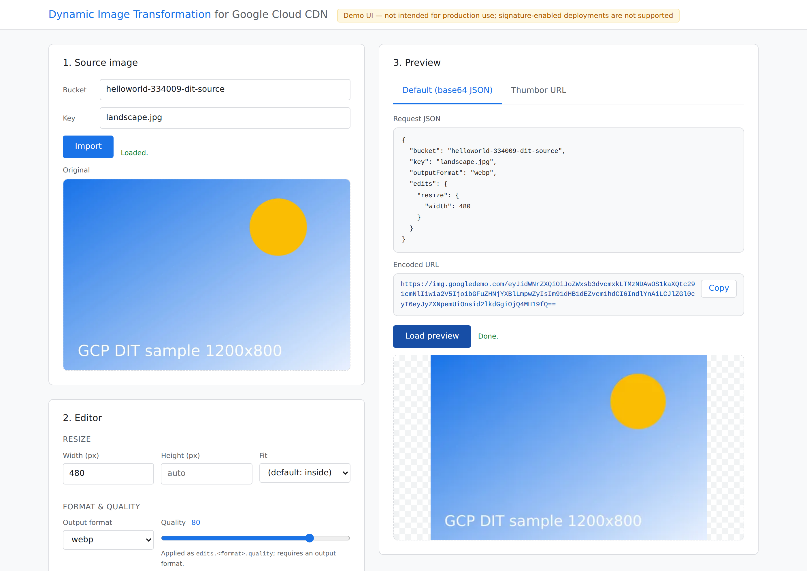
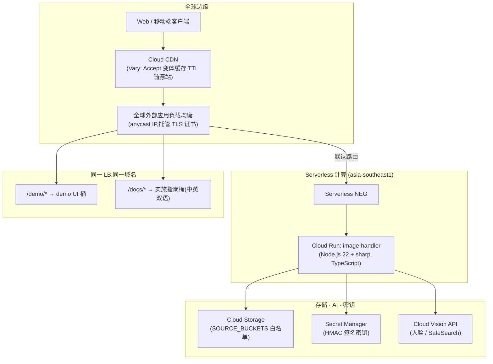

# Dynamic Image Transformation for Google Cloud CDN(GCP 动态图片处理方案)

**🇨🇳 中文文档** | [🇺🇸 English Documentation](./README.md)

[](https://cloud.google.com/run)
[](https://nodejs.org)
[](https://github.com/aws-solutions/dynamic-image-transformation-for-amazon-cloudfront)
[](./source/image-handler/test)
[](./source/image-handler/jest.config.js)

> **AWS 官方方案 "Dynamic Image Transformation for Amazon CloudFront"(v7 serverless 架构,前身 Serverless Image Handler)的 Google Cloud 原生对标实现。**
> URL 格式、base64 JSON 请求 schema、20 个 Thumbor 滤镜、HMAC 请求签名、错误 JSON 与响应头**逐字段兼容** AWS——从 CloudFront 迁移的客户端**零代码改动**直接使用,同时获得 Cloud Run 高并发、Cloud CDN 边缘缓存与 Cloud Vision AI 能力。

---

## 🔗 在线体验

<p align="center">
  <a href="https://img.googledemo.com/demo/index.html"></a>
  &nbsp;&nbsp;
  <a href="https://img.googledemo.com/docs/index.html"></a>
</p>

- **🎛️ Demo UI — [img.googledemo.com/demo](https://img.googledemo.com/demo/index.html)**:图形化请求调试器。从源桶导入图片,在编辑器里调 resize/格式/质量/AI 编辑,实时看到处理效果,并同步生成可直接复制进应用的**请求 JSON** 和 **base64 编码 URL**。
- **📖 实施指南 — [img.googledemo.com/docs](https://img.googledemo.com/docs/index.html)**:中英双语、Google Cloud 官方文档风格的完整文档站——架构、部署、Thumbor 滤镜参考、API 参考与故障排查。

<p align="center">
  <a href="https://img.googledemo.com/demo/index.html"></a>
  <br/><em>Demo UI:源图导入 → 编辑器 → 实时预览,同步生成请求 JSON 与编码 URL。</em>
</p>

---

## 🌟 核心亮点

1. **100% AWS API 兼容——实测验证,而非口号。** 三种 AWS 请求格式全部按源码级兼容规格([`docs/COMPAT_SPEC.md`](./docs/COMPAT_SPEC.md),逐文件核对 AWS 官方源码)实现:
   - `DEFAULT` — base64 JSON 路径:`/{base64(JSON)}`
   - `THUMBOR` — Thumbor 路径:`/fit-in/300x400/filters:format(webp):quality(60)/key.jpg`(20 个滤镜全量)
   - `CUSTOM` — `REWRITE_MATCH_PATTERN` / `REWRITE_SUBSTITUTION` 正则重写
   - Query 参数编辑(`?width=&height=&format=&fit=…`)在所有请求类型上叠加,与 AWS 一致。连 AWS 的怪癖(base64 字符集判型、滤镜链解析语义)都逐字节保留——见[兼容性说明](#-兼容性说明)。
2. **AWS 没有的迁移增强。** Thumbor 路径同时识别 `s3:<bucket>/` 与 `gs:<bucket>/` 前缀;可选 `BUCKET_MAP` 环境变量把旧 S3 桶名透明映射到 GCS 桶——存储迁移后老 URL 继续可用。
3. **AI 能力换用 Cloud Vision。** `smartCrop`(FACE_DETECTION,人脸按包围盒面积降序、结果确定)与 `contentModeration`(SAFE_SEARCH_DETECTION,likelihood→置信度映射)对标 Amazon Rekognition;Rekognition 标签名(如 `"Explicit Nudity"`)自动别名映射,迁移客户的审核配置无需修改。
4. **安全对等。** HMAC-SHA256 请求签名(`?signature=`,待签串与 hex 摘要逐字节一致),密钥存 Secret Manager(JSON 载荷约定与 AWS Secrets Manager 相同);`?expires=` 限时链接;Terraform 全程资源级最小权限 IAM。
5. **Cloud CDN 的正确打开方式。** 缓存 TTL 跟随源站 `Cache-Control`(成功 1 年、4xx 10 秒、5xx 600 秒,与 AWS 一致);AUTO_WEBP 变体通过 `Vary: Accept` 独立缓存——GCP 缓存键不允许包含 `Accept` 头,这是与 CloudFront 的真实差异,本项目已替你解决。
6. **两种部署方式,同一份真相。** 交互式 **Launch Wizard**(支持 Cloud Shell)与模块化 **Terraform**——向导内部驱动同一套 Terraform 模块,两条路径产出完全一致的基础设施。

---

## 🏛️ 架构



| AWS(v7 serverless) | 本方案 |
|---|---|
| Amazon CloudFront | Cloud CDN + 全球外部应用负载均衡 |
| CloudFront Function(请求归一化) | 服务内归一化中间件(相同的 Accept/query 规范化) |
| API Gateway + Lambda(Node.js + sharp) | Cloud Run(Node.js 22 + sharp,无 6MB/29s 硬限制) |
| Amazon S3 | Cloud Storage(+ `gs:` 前缀、`BUCKET_MAP` 桶名映射) |
| AWS Secrets Manager | Secret Manager(相同 JSON 载荷约定) |
| Amazon Rekognition | Cloud Vision(FACE_DETECTION / SAFE_SEARCH_DETECTION) |
| CloudWatch | Cloud Logging / Cloud Monitoring |
| CloudFormation 一键部署 | Launch Wizard(Cloud Shell) |
| CDK 源码部署 | Terraform 模块 |

---

## 🚀 快速上手——API 一览

```bash
ENDPOINT="https://img.googledemo.com"      # 你部署的域名

# 1) CloudFront 时代的 Thumbor 老 URL——原样可用
curl -o thumb.jpg  "$ENDPOINT/fit-in/300x200/landscape.jpg"
curl -o gray.webp  "$ENDPOINT/filters:format(webp)/filters:quality(60)/filters:grayscale()/landscape.jpg"

# 2) base64 JSON(DEFAULT)——schema 与 AWS 完全一致
REQ=$(echo -n '{"bucket":"my-bucket","key":"landscape.jpg","edits":{"resize":{"width":400}}}' | base64 -w0)
curl -o resized.jpg "$ENDPOINT/$REQ"

# 3) Query 参数编辑
curl -o out.png "$ENDPOINT/landscape.jpg?width=200&format=png"

# 4) AI 智能裁剪(Cloud Vision 人脸检测)
curl -o face.jpg "$ENDPOINT/filters:smart_crop(0,10)/portrait.jpg"
```

图形化 **Demo UI**(对标 AWS Demo UI)在 `/demo/index.html`;完整双语实施指南在 `/docs/index.html`。

---

## 📦 仓库结构

```
source/image-handler/     TypeScript 服务:请求解析、sharp 管线、299 个 Jest 测试
source/demo-ui/           静态 Demo UI(请求构造器 + 实时预览)
source/docs-site/         客户实施指南(中英双语,Google 文档风格)
infra/terraform/          部署方式二:根模块 + {buckets,secret,cloud-run,network-lb}
infra/launch-wizard/      部署方式一:交互式向导 + Cloud Shell 教程
deployment/               run-unit-tests.sh · build-and-deploy.sh · run-e2e-tests.sh
docs/COMPAT_SPEC.md       AWS 兼容性权威规格(逐源码核对)
samples/                  测试图片(含公有领域人像,用于智能裁剪演示)
storyline-run.md          9 个演练场景——每条命令都在生产环境验证过
```

---

## 🛠️ 部署

### 方式一 — Launch Wizard(交互式,Cloud Shell 友好)

```bash
cd infra/launch-wizard
./launch-wizard.sh              # 交互提问对标 AWS CloudFormation 参数表
./launch-wizard.sh --dry-run    # 只做 terraform plan
./launch-wizard.sh --destroy    # 引导式卸载
```

### 方式二 — Terraform

```bash
deployment/build-and-deploy.sh                 # Cloud Build 构建镜像 + terraform apply
deployment/build-and-deploy.sh --plan-only     # dry run

# 或完全手动
cd infra/terraform
terraform init
terraform apply -var-file=example.tfvars
```

两条路径驱动同一套 Terraform 模块。核心变量对标 AWS CloudFormation 参数(`source_buckets`、`cors_enabled`、`auto_webp`、`enable_signature`、`enable_default_fallback_image` 等)——完整表见 [`infra/terraform/variables.tf`](./infra/terraform/variables.tf) 或[部署指南](./source/docs-site/zh/deploy.html)。

**环境变量沿用 AWS 原名**(`SOURCE_BUCKETS`、`AUTO_WEBP`、`ENABLE_SIGNATURE`、`SECRETS_MANAGER`、`SECRET_KEY`、`REWRITE_MATCH_PATTERN`、`SHARP_SIZE_LIMIT` 等),另加 GCP 扩展:`BUCKET_MAP`(S3→GCS 桶名映射)、`COMPAT_AWS_LIMITS`(严格复刻 6MB/413 行为)。

---

## 🧪 测试与验证

**单元测试** — Jest 29,测试目录结构镜像 AWS 官方仓库(`image-request/`、`thumbor-mapper/`、`image-handler/`、`request-normalizer/`):

```bash
deployment/run-unit-tests.sh
# Test Suites: 29 passed · Tests: 299 passed · 行覆盖率 98.15%(阈值 80%)
```

**端到端测试** — 针对真实部署运行,覆盖三种请求类型、错误 JSON 结构、CORS、AUTO_WEBP 内容协商、HMAC 签名正反用例:

```bash
BASE_URL=https://img.googledemo.com deployment/run-e2e-tests.sh
# Results: 6 passed, 0 failed, 1 skipped(ENABLE_SIGNATURE=No 时签名用例自动跳过)
# ENABLE_SIGNATURE=Yes 时:7 passed, 0 failed, 0 skipped
```

套件之外的线上实测:Vision 智能裁剪(人脸 → 360×415 特写)、水印合成、GIF 动图保帧、CDN 缓存命中(`Age` 头)与 `Vary: Accept` 的 webp/jpeg 独立变体、托管 TLS 证书(Google Trust Services)、4xx/5xx 负缓存 TTL。

---

## 💰 成本模型(估算)

固定成本 ≈ **$18/月**(全球 LB 转发规则)+ Secret Manager/GCS 零头;服务成本以 CDN 出流量为主,Cloud Run 空闲缩容到零。按 90% 缓存命中、平均输出 45 KB(APAC 出流量 $0.09–0.14/GB)估算:

| 档位 | 月请求量 | 预估总成本 |
|---|---|---|
| POC / 小型站点 | 50 万 | ≈ $20–25 |
| 中型应用 | 1000 万 | ≈ $60–110 |
| 大型电商 / 媒体 | 1.25 亿 | ≈ $550–900 |

完整假设与 5 亿档测算见[成本规划页](./source/docs-site/zh/plan.html)。Cloud Vision(智能裁剪/审核)仅在缓存未命中时按张计费,每月前 1,000 次免费。

---

## 📚 文档矩阵

| 文档 | 说明 |
|---|---|
| [实施指南(中英双语)](./source/docs-site/) | 10 章客户文档,Google Cloud 官方文档风格,部署后在 `/docs/` 在线可读 |
| [`docs/MIGRATION_zh.md`](./docs/MIGRATION_zh.md)([English](./docs/MIGRATION.md)) | **AWS → GCP 迁移指南**:9 阶段零停机方案——评估、S3→GCS 传输、密钥迁移、影子验证、证书预签发、加权 DNS 灰度、回滚、下线——附完整 CFN→Terraform 参数映射表与最佳实践。在线版:[`/docs/zh/migrate.html`](https://img.googledemo.com/docs/zh/migrate.html) |
| [`docs/COMPAT_SPEC.md`](./docs/COMPAT_SPEC.md) | 兼容性权威契约——每个滤镜、错误码、响应头、环境变量,逐 AWS 源码核对 |
| [`storyline-run.md`](./storyline-run.md) | 上手演练:9 个可直接复制的场景(迁移 URL、AI 裁剪、签名、CDN 观测) |
| [`DESIGN.md`](./DESIGN.md) | 架构决策、AWS→GCP 服务映射依据、权限模型 |

---

## 📌 兼容性说明

为迁移客户端零行为漂移而**原样保留的 AWS 怪癖**:

- 请求判型仅凭 base64 正则判定 `DEFAULT`——纯 base64 字符组成但非 JSON 的路径返回 `400 DecodeRequest::CannotDecodeRequest`,与 AWS 完全一致。
- `filters:a():b()` 链式写法只有第一个滤镜生效(AWS 正则语义);请写成多个独立 `filters:` 段。
- 错误响应体为 `{"status":<int>,"code":"<Code>","message":"<text>"}`,错误码与文案(含 `404 NoSuchKey` 措辞)与 AWS 逐字一致。

**已文档化的差异**(均为可选项或纯增强):

- 无 6 MB 响应 / 29 秒超时硬限制(Cloud Run);设 `COMPAT_AWS_LIMITS=Yes` 可恢复 413 行为。
- 智能裁剪人脸排序确定(按包围盒面积降序);Vision 只识别真实照片人脸(画作可能返回"无人脸",Rekognition 未必)。
- AUTO_WEBP 变体缓存采用 `Vary: Accept`(Cloud CDN 缓存键禁止包含 `Accept` 头)。

---

## 📄 许可证

Apache-2.0。本项目是对 Apache-2.0 许可的 [aws-solutions/dynamic-image-transformation-for-amazon-cloudfront](https://github.com/aws-solutions/dynamic-image-transformation-for-amazon-cloudfront) 的独立移植实现。为 Google Cloud 客户工程师与 AWS→GCP 迁移场景倾心打造 ❤️
