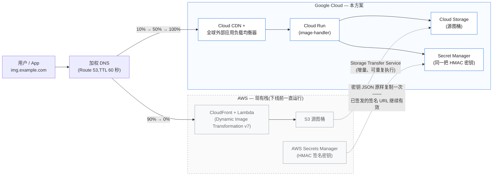

# 迁移指南 — 从 AWS Dynamic Image Transformation 迁移到 Google Cloud

> **[English version (英文版)](./MIGRATION.md)**

本指南面向已在生产环境使用 AWS 解决方案
**[Dynamic Image Transformation for Amazon CloudFront](https://aws.amazon.com/solutions/implementations/dynamic-image-transformation-for-amazon-cloudfront/)**
(v7 serverless 架构)的团队,帮助你在**客户端零改动**的前提下迁移到
**Dynamic Image Transformation for Google Cloud CDN**。

整个迁移方案建立在一句话承诺之上:

> **URL API、签名算法、错误契约与 AWS 逐字段一致**(见
> [`COMPAT_SPEC.md`](./COMPAT_SPEC.md))。你的应用、移动端、CMS 模板、
> 已签发的签名 URL 全部原样可用——唯一变化的只是 DNS 记录指向哪里。

---

## 1. 迁移全景

| 阶段 | 做什么 | 客户端影响 | 典型耗时 |
|---|---|---|---|
| 1. 评估 | 盘点 AWS 栈:参数、桶、流量、实际用到的功能 | 无 | 1–2 天 |
| 2. 迁移图片 | S3 → GCS,用 Storage Transfer Service(增量、可重复执行) | 无 | 数小时–数天(取决于数据量) |
| 3. 迁移签名密钥 | 同一把 HMAC 密钥进 Secret Manager → 旧签名 URL 继续有效 | 无 | 几分钟 |
| 4. 部署 GCP 栈 | Launch Wizard 或 Terraform,参数 1:1 对应 | 无 | 约 30 分钟 |
| 5. 验证 | 单测/e2e 套件 + 回放真实生产 URL 做对比 | 无 | 1–2 天 |
| 6. 预签发 TLS 证书 | Certificate Manager DNS 授权,切流**之前**证书就 ACTIVE | 无 | 约 1 小时 |
| 7. 切流 | 加权 DNS 10% → 50% → 100%,低 TTL,盯错误率 | 无感知 | 1–7 天(灰度观察期) |
| 8. 回滚(如需) | 把 DNS 权重拨回去——AWS 栈一直在运行 | 无感知 | 分钟级 |
| 9. 下线 AWS | 删除 CloudFormation 栈,S3 保留一个观察期后再清 | 无 | 观察期结束后 |

迁移全程两套栈并行运行,没有"一刀切"时刻,也不需要停机窗口。



---

## 2. 阶段 1 — 评估现有 AWS 部署

先把当前栈的参数拉出来——它们与本方案 1:1 对应:

```bash
aws cloudformation describe-stacks \
  --stack-name <your-DIT-stack> \
  --query "Stacks[0].Parameters" --output table
```

同时建议收集:

```bash
# 图片处理 Lambda 的环境变量(运行时配置的权威来源)
aws lambda get-function-configuration \
  --function-name <stack>-ImageHandlerFunction... \
  --query "Environment.Variables"

# 生产环境实际用了哪些请求类型/滤镜?
# 拉一天的 CloudFront 访问日志,看路径形态:
#   /eyJi...          → Default(base64 JSON)
#   /fit-in/...       → Thumbor
#   其他              → Custom(重写)
aws s3 cp s3://<cf-log-bucket>/<prefix>/ . --recursive --exclude "*" --include "*2026-07*"
```

进入下一阶段前的盘点清单:

| 问题 | 去哪里查 | 决定什么 |
|---|---|---|
| 用了哪些请求类型(Default / Thumbor / Custom)? | CloudFront 日志 | 验证范围;Custom 需要 `REWRITE_*` 变量 |
| `SourceBucketsParameter` 的值 | CFN 参数 | GCS 桶名 + `BUCKET_MAP` |
| `EnableSignatureParameter` 是否为 Yes? | CFN 参数 | 密钥迁移(阶段 3) |
| Secrets Manager 密钥名 + JSON key | CFN 参数 | GCP 侧保持同值 |
| `AutoWebPParameter`、`CorsEnabledParameter`、`CorsOriginParameter` | CFN 参数 | GCP 侧保持同值 |
| 兜底图桶/key | CFN 参数 | 这个对象也要复制过来 |
| 月请求量 + 缓存命中率 | CloudFront 控制台 → Reports | 成本估算、灰度节奏 |
| 有没有客户端依赖 6 MB / 413 响应上限? | 应用团队 | `COMPAT_AWS_LIMITS` |
| 指向 CloudFront 的 DNS 记录 TTL | Route 53 | 切流速度;现在就调低 |

> **提示:**项目第一天就把图片域名的 DNS TTL 降到 60 秒。TTL 变更要等一个旧
> TTL 周期才全网生效,提前做,等于免费拿到"秒级切流 + 秒级回滚"能力。

---

## 3. 阶段 2 — 参数映射(CloudFormation → Terraform)

Launch Wizard 的交互提示与 Terraform 变量刻意沿用了 CloudFormation
参数命名。完整映射表:

| AWS CloudFormation 参数 | Terraform 变量(`infra/terraform`) | 容器环境变量(两云一致) | 说明 |
|---|---|---|---|
| `SourceBucketsParameter` | `source_buckets` | `SOURCE_BUCKETS` | 逗号分隔;第一个是默认桶 |
| `CorsEnabledParameter` | `cors_enabled` | `CORS_ENABLED` | `Yes`/`No` |
| `CorsOriginParameter` | `cors_origin` | `CORS_ORIGIN` | |
| `AutoWebPParameter` | `auto_webp` | `AUTO_WEBP` | 见 [§11 差异说明](#11-需要了解的行为差异)——通过 `Vary: Accept` 实现 |
| `EnableSignatureParameter` | `enable_signature` | `ENABLE_SIGNATURE` | |
| `SecretsManagerSecretParameter` | `secret_name` | `SECRETS_MANAGER` | Secret Manager 密钥 ID |
| `SecretsManagerKeyParameter` | `secret_key_name` | `SECRET_KEY` | 密钥 JSON 里的 key |
| `EnableDefaultFallbackImageParameter` | `enable_default_fallback_image` | `ENABLE_DEFAULT_FALLBACK_IMAGE` | |
| `FallbackImageS3BucketParameter` | `fallback_image_bucket` | `DEFAULT_FALLBACK_IMAGE_BUCKET` | 现在是 GCS 桶 |
| `FallbackImageS3KeyParameter` | `fallback_image_key` | `DEFAULT_FALLBACK_IMAGE_KEY` | |
| `DeployDemoUIParameter` | `deploy_demo_ui` | — | 静态桶托管,路径 `/demo/` |
| (SIH v5 `RewriteMatchPattern` / 自定义模板) | `rewrite_match_pattern` / `rewrite_substitution` | `REWRITE_MATCH_PATTERN` / `REWRITE_SUBSTITUTION` | 启用 Custom 请求类型 |
| `SharpSizeLimit`(环境变量) | `sharp_size_limit` | `SHARP_SIZE_LIMIT` | |
| `LogRetentionPeriodParameter` | — | — | 在 [Cloud Logging 保留策略](https://cloud.google.com/logging/docs/buckets)里设置 `_Default` 桶 |
| `CloudFrontPriceClassParameter` | — | — | 无需对应:Cloud CDN 全球单一价目表 |
| `LambdaMemorySizeParameter` | — | — | Cloud Run 默认 1 vCPU / 1 GiB;需调整改 `modules/cloud-run` |
| —(GCP 新增) | `bucket_map` | `BUCKET_MAP` | `s3桶名=gcs桶名` 别名——见下文,迁移的关键辅助 |
| —(GCP 新增) | `compat_aws_limits` | `COMPAT_AWS_LIMITS` | `Yes` 时复刻 Lambda 6 MB / `413 TooLargeImageException` 限制 |

### `BUCKET_MAP` — 让 URL 里的 S3 桶名继续可用

如果你的生产 URL **内嵌了桶名**——Default 请求 JSON 里带 `"bucket"` 字段,
或 Thumbor/Custom 路径形如 `/my-s3-bucket:photos/cat.jpg`——这些是 S3
桶名,GCS 上大概率不存在(桶名全局唯一,很难原名迁移)。你**不需要**重新生成
任何 URL,只需配置:

```hcl
bucket_map = "my-s3-bucket=my-project-images,other-s3-bucket=my-project-other"
```

所有指名 `my-s3-bucket` 的请求会被透明地转到 GCS 桶
`my-project-images`。显式的 `s3:my-s3-bucket:key` 前缀同样接受并映射。
白名单校验(`SOURCE_BUCKETS`)作用在*映射后*的桶名上,与 AWS 语义一致。

---

## 4. 阶段 3 — 复制图片(S3 → GCS)

**推荐 [Storage Transfer Service](https://cloud.google.com/storage-transfer-service)**——
全托管、并行、带校验和,不用自己搭中转机,最重要的是**可重复/增量**:
先跑一次全量,之后随时重跑(或按天调度),把切流前写入 S3 的新图持续同步过来。

```bash
# 给迁移用的一次性 AWS 凭据(S3 只读即可)
cat > /tmp/aws-creds.json <<'EOF'
{"accessKeyId": "AKIA...", "secretAccessKey": "..."}
EOF

# 目标桶(Terraform 也会为你创建 <prefix>-source;
# 任何列入 SOURCE_BUCKETS 的桶都可以)
gcloud storage buckets create gs://my-project-images \
  --location=asia-southeast1 --uniform-bucket-level-access

# 全量复制 + 之后的增量重跑(只复制新增/变更对象)
gcloud transfer jobs create s3://my-s3-bucket gs://my-project-images \
  --source-creds-file=/tmp/aws-creds.json \
  --name=dit-migration-images

# 随时增量重跑:
gcloud transfer jobs run dit-migration-images
```

小桶(几 GB 以内)直接在装了两套 CLI 的机器上普通拷贝即可:

```bash
aws s3 sync s3://my-s3-bucket /tmp/images && \
gcloud storage cp -r /tmp/images/* gs://my-project-images/
```

验证前先**核对**对象数量并抽查校验和:

```bash
aws s3 ls s3://my-s3-bucket --recursive --summarize | tail -2
gcloud storage ls -r gs://my-project-images/** | wc -l
```

如果 `ENABLE_DEFAULT_FALLBACK_IMAGE=Yes`,别忘了把**兜底图**对象也复制过来。

> **对象 key 必须保持一致。**方案按 URL/JSON 里出现的精确 key 取对象——复制
> 过程中不要改名、加前缀或拍平目录结构。

---

## 5. 阶段 4 — 迁移签名密钥

如果 `EnableSignature` 为 `No`,跳过本节。

签名是 `HMAC-SHA256(path + 排序后的 query)` 的 hex 摘要——**同一把密钥在两朵
云上算出同样的签名**,所以把密钥迁过来,所有已签发的签名 URL(包括嵌在邮件、
App 里的长期链接)继续有效。把密钥 JSON 原样复制:

```bash
# 从 AWS Secrets Manager 取出原始 JSON 文档
aws secretsmanager get-secret-value \
  --secret-id <SecretsManagerSecretParameter> \
  --query SecretString --output text > /tmp/dit-sig.json
# 例如 {"signatureKey":"<hex-or-passphrase>"}
```

Terraform 栈会替你创建 Secret Manager 密钥——apply 时把文档传进去
(永远不要提交到代码库):

```bash
terraform apply -var-file=example.tfvars \
  -var "signature_secret_json=$(cat /tmp/dit-sig.json)"
```

`secret_key_name` 保持与 AWS 的 `SecretsManagerKeyParameter` 一致(JSON
key,如 `signatureKey`)。完成后删除 `/tmp/dit-sig.json` 和
`/tmp/aws-creds.json`。

---

## 6. 阶段 5 — 部署 GCP 栈

两条部署路径任选——它们驱动同一套 Terraform 模块:

- **Launch Wizard**(CloudFormation 风格交互式问答):
  `infra/launch-wizard/launch-wizard.sh`——每个提示项都对应它替代的 CFN
  参数。支持 `--dry-run`。
- **Terraform** 直接部署:`infra/terraform/` + tfvars 文件。

迁移场景的 `terraform.tfvars` 长这样:

```hcl
project_id       = "my-project"
region           = "asia-southeast1"
domain           = "img.example.com"          # 与 CloudFront 今天服务的是同一个域名
source_buckets   = "my-project-images"
bucket_map       = "my-s3-bucket=my-project-images"
auto_webp        = "Yes"                       # 照抄你的 AWS 参数值
cors_enabled     = "No"
enable_signature = "Yes"
secret_name      = "dit-signature-secret"
secret_key_name  = "signatureKey"
compat_aws_limits = "No"                       # 只有客户端依赖 6 MB/413 行为时才设 "Yes"
```

部署后记下输出——阶段 7 会用到 `lb_ip`:

```bash
cd infra/terraform
terraform init
terraform apply -var-file=terraform.tfvars \
  -var "signature_secret_json=$(cat /tmp/dit-sig.json)"
terraform output   # api_endpoint、lb_ip、cloud_run_url ...
```

> `domain` 的 Google 托管证书在 DNS 指向 LB 之前会一直处于
> `PROVISIONING`——这是预期行为,**不阻塞验证**:阶段 6 走 LB IP/HTTP 或
> 预签发的 Certificate Manager 证书(阶段 7a),完全不需要为了测试而提前切
> DNS。

---

## 7. 阶段 6 — 切流前的验证

### 7.1 跑内置测试套件

```bash
deployment/run-unit-tests.sh                     # 299 个单元测试
BASE_URL=http://<lb_ip> deployment/run-e2e-tests.sh   # 针对线上栈的 7 个 e2e 测试
```

### 7.2 回放真实生产 URL(影子对比)

最强的信号来自你自己的流量。从一天的 CloudFront 访问日志里提取最高频的图片
路径(第 8 列是 `cs-uri-stem`),对两套栈逐一回放,对比状态码、Content-Type
和像素:

```bash
# 生产环境 top-1000 路径
zcat *.gz | awk -F'\t' '$8 ~ /^\// {print $8}' | sort | uniq -c | sort -rn \
  | head -1000 | awk '{print $2}' > paths.txt

AWS=https://img.example.com          # 此时仍指向 CloudFront
GCP=http://<lb_ip>                   # 或用预签发证书走 https
while read -r p; do
  a=$(curl -s -o /tmp/a -w '%{http_code} %{content_type}' "$AWS$p")
  g=$(curl -s -o /tmp/g -w '%{http_code} %{content_type}' "$GCP$p" -H "Host: img.example.com")
  if [ "$a" != "$g" ]; then echo "HEADER-DIFF $p  aws[$a]  gcp[$g]"; fi
  # 可选的像素级对比(不同编码器版本字节数会略有差异):
  # compare -metric AE /tmp/a /tmp/g null: 2>&1
done < paths.txt
```

预期结果:

- **状态码、错误 JSON 体、`Content-Type`**——必须完全一致。
- **字节大小**——可能略有差异(sharp/libvips 编码器版本漂移);视觉输出应当
  等价。用像素 diff,不要用字节 diff。
- **`smartCrop` 输出**——Cloud Vision 与 Rekognition 的人脸框略有不同;裁剪
  结果等价但非字节一致。人工抽查即可。

### 7.3 一致性核对清单

- [ ] 生产在用的每种请求类型(Default / Thumbor / Custom)各取一条 URL,返回 200
- [ ] 用你**现有 AWS 签名代码**生成的签名 URL 在 GCP 侧验签通过
- [ ] 不存在的 key 返回 `404 {"status":404,"code":"NoSuchKey",...}`
- [ ] 篡改签名返回 `403 SignatureDoesNotMatch`
- [ ] `AUTO_WEBP`:带 `Accept: image/webp` 的请求返回 `image/webp`,不带则返回原格式,且响应携带 `Vary: Accept`
- [ ] 兜底图行为(若启用)一致
- [ ] CDN 缓存生效:对同一 URL 连发**两次 `GET`** → 第二次带 `Age` 头(Cloud CDN 不缓存 `HEAD`——别用 `curl -I` 测)

---

## 8. 阶段 7 — 切流

### 8a. 预签发 TLS 证书(零停机的前提)

Terraform 创建的经典 Google 托管证书要等 DNS 指向 LB *之后*才能激活——对零
停机迁移是个先有鸡还是先有蛋的问题。用 **Certificate Manager DNS 授权**解决:
通过一条一次性 CNAME 证明域名所有权,在 **CloudFront 仍承载 100% 流量时**就把
证书签出来:

```bash
gcloud certificate-manager dns-authorizations create dit-authz \
  --domain=img.example.com
gcloud certificate-manager dns-authorizations describe dit-authz \
  --format="value(dnsResourceRecord.name,dnsResourceRecord.data)"
# → 把这条 CNAME 加到你的 DNS(不影响正在服务的流量)

gcloud certificate-manager certificates create dit-cert \
  --domains=img.example.com --dns-authorizations=dit-authz
gcloud certificate-manager maps create dit-cert-map
gcloud certificate-manager maps entries create dit-cert-map-entry \
  --map=dit-cert-map --certificate=dit-cert --hostname=img.example.com

# 把证书 map 挂到 Terraform 创建的 HTTPS 代理上
# (证书 map 优先级高于代理上的经典证书)
gcloud compute target-https-proxies update <prefix>-https-proxy \
  --certificate-map=dit-cert-map
```

等 `gcloud certificate-manager certificates describe dit-cert` 显示
`ACTIVE` 后,先对 LB IP 验证 HTTPS 可用,再动 DNS:

```bash
curl -sv --resolve img.example.com:443:<lb_ip> \
  https://img.example.com/<any-test-path> -o /dev/null
```

### 8b. 加权 DNS 灰度

两侧证书都就绪后,逐步切流(以 Route 53 为例):

```bash
# 10% GCP / 90% CloudFront——同一域名下两条加权记录:
#   img.example.com  A      <lb_ip>              weight 10, set-id "gcp"
#   img.example.com  ALIAS  dxxxx.cloudfront.net weight 90, set-id "aws"
```

10% 观察一天,两侧都盯着,然后 50%,再 100%。全程 TTL 保持 60 秒。

**灰度期间 GCP 侧盯什么:**

```bash
# LB:所有 4xx/5xx(和你的 CloudFront 基线比,不是和零比)
gcloud logging read 'resource.type="http_load_balancer"
  httpRequest.status>=400' --freshness=1h --limit=50 \
  --format="table(httpRequest.status,httpRequest.requestUrl)"

# Cloud Run:应用错误
gcloud logging read 'resource.type="cloud_run_revision"
  resource.labels.service_name="<prefix>-image-handler" severity>=ERROR' \
  --freshness=1h --limit=50
```

同时关注:Cloud CDN 缓存命中率(控制台 → 网络服务 → Cloud CDN →
监控)——从接近 0% 起步,随缓存预热几小时内应爬向你的 CloudFront 基线;
Cloud Run p95 延迟与实例数。

> **缓存预热。**冷 CDN 意味着每个 URL 在每个边缘节点的首个请求要付完整的
> 转换成本。10% 灰度下这基本无感;如需更稳,可在提升权重前用阶段 7.2 的
> `paths.txt` 对新端点 GET 一遍 top-N URL 预热。

### 8c. 冻结,然后迁移写入路径

灰度期间让 S3→GCS 传输任务按计划持续跑,新上传的图两边都有。到 100% 之后:
把**上传/写入路径**(CMS、媒体流水线)指向 GCS,最后跑一次
`gcloud transfer jobs run` 清掉尾差,然后停掉任务。

---

## 9. 回滚预案

回滚只是一次 DNS 权重变更,仅此而已:

1. 把 CloudFront 记录权重拨回 100 / GCP 拨到 0(≤ TTL = 60 秒内生效)。
2. 迁移全程从未改动或缩容 AWS 栈——它直接恢复承载。
3. 如果已经把写入路径切到 GCS,重试前需把切换后写入 GCS 的图片反向同步回
   S3(反向 `aws s3 sync` 或反向传输任务)——这是唯一需要对账的状态,且仅在
   已迁移写入路径时才存在。

这份回滚能力要保留到观察期结束(通常 100% 流量后再跑 1–2 周)。

---

## 10. 阶段 9 — 下线 AWS

观察期结束后:

```bash
# 1. 删除 AWS 侧的加权 DNS 记录(留一条普通记录 → GCP LB IP)
# 2. 删除解决方案栈
aws cloudformation delete-stack --stack-name <your-DIT-stack>
# 3. 释放未随栈删除的 ACM 证书 / CloudFront 分发
# 4. S3 桶只读保留一个窗口期(30–90 天)后删除。GCS 从此是唯一数据源。
aws s3api put-bucket-policy ...   # 可选:保留期内拒绝写入
```

成本核对:AWS 侧残余账单应只剩 S3 存储;把 GCP 第一个完整月的账单和
[部署规划的估算](../source/docs-site/zh/plan.html)对一下。

---

## 11. 需要了解的行为差异

完整契约见 [`COMPAT_SPEC.md`](./COMPAT_SPEC.md)。以下差异都**不需要改客户
端**,但运维和测试需要知道:

| 方面 | AWS | GCP(本方案) | 影响 |
|---|---|---|---|
| WebP 变体缓存 | CloudFront 缓存策略把 `Accept` 头放进缓存键 | Cloud CDN 禁止 `Accept` 进缓存键 → 服务发出 `Vary: Accept`,Cloud CDN 原生缓存变体 | 客户端无感;若你自建 CDN 探测,`AUTO_WEBP=Yes` 时预期响应带 `Vary: Accept` |
| `HEAD` 请求 | CloudFront 从缓存响应 | **Cloud CDN 只缓存/回源 `GET`**——`HEAD` 永远打到源站 | 监控和缓存测试用 `GET`(别用 `curl -I`) |
| 最大响应体 | 6 MB(Lambda 限制)→ `413 TooLargeImageException` | 32 MB(Cloud Run) | 严格更宽松;客户端依赖 413 行为时设 `COMPAT_AWS_LIMITS=Yes` |
| 人脸检测(`smartCrop`) | Amazon Rekognition | Cloud Vision `FACE_DETECTION` | 行为等价,人脸框略有差异 → 裁剪非字节一致;Vision(和 Rekognition 一样)对画作/插画中的人脸可能检测不到 |
| 内容审核 | Rekognition 审核标签 | Vision `SAFE_SEARCH_DETECTION`,likelihood 映射为 0–100 置信度,接受常见标签别名 | 请求/响应形态一致 |
| 冷启动 | Lambda 每请求独立沙箱 | Cloud Run 实例并发处理请求;可配 `min_instances` | 缓存未命中突发时冷启动通常更少 |
| 日志与指标 | CloudWatch | Cloud Logging / Cloud Monitoring | 重建看板和告警(查询语句见 §8b) |
| 计价模型 | CloudFront price class | Cloud CDN 全球单一价目表 | 忘掉 `CloudFrontPriceClass` 即可 |
| URL 里的桶名前缀 | 接受 `s3:` | 同时接受 `s3:` **和** `gs:`;`BUCKET_MAP` 别名 S3 桶名 | 旧 URL 原样可用 |

---

## 12. 最佳实践清单

- [ ] **第一天就把 DNS TTL 降到 60 秒**——切流和回滚都变成秒级操作。
- [ ] **绝不重新生成签名 URL**——迁移密钥(阶段 4)就够了。
- [ ] **用 Storage Transfer Service 并加调度**,不要一次性拷贝——否则拷贝
      与切流之间的增量就是你的数据丢失窗口。
- [ ] **用 DNS 授权预签发证书**——永远不要让证书签发卡住切流。
- [ ] **首次部署所有参数值与 AWS 保持一致**(尤其 `AUTO_WEBP`、`CORS_*`、
      签名相关)。想改进,等迁移稳定后一次改一个变量。
- [ ] **用生产 URL 验证**,不要只跑合成测试(阶段 7.2)。
- [ ] **加权 DNS 灰度**,4xx/5xx 比率和你的 CloudFront 基线比,不是和零比。
- [ ] **观察期结束前不要下线 AWS**——回滚必须始终是一个 60 秒操作。
- [ ] **先迁读路径,最后迁写路径**(阶段 8c)。
- [ ] **删掉凭据/密钥临时文件**(`/tmp/dit-sig.json`、`/tmp/aws-creds.json`),
      永远不要提交到代码库。

---

## 13. FAQ

**应用里的图片 URL 需要改吗?**
不需要。三种请求类型、签名方案、`expires`、错误体和响应头完全一致。内嵌
S3 桶名的 URL 由 `BUCKET_MAP` 处理。

**两套栈能长期并行(多云)吗?**
可以——灰度阶段本身就是多云并行。唯一的持续要求是保持源图片 S3⇄GCS 同步。

**客户端用 AWS SDK 代码签 URL,还能用吗?**
能。签名就是共享密钥的 `HMAC-SHA256(path[?sorted-query])` hex 摘要——里面
没有任何 AWS 专有的东西。同一把密钥,同样的签名。

**全量拷贝之后又上传到 S3 的图怎么办?**
重跑 Storage Transfer Service 任务(或按小时/天调度)。它只复制新增/变更
对象。

**我们用了 Custom 请求类型和重写正则。**
把 `rewrite_match_pattern` / `rewrite_substitution` 设成与 AWS 模板相同的
值,语义完全一致。

**Demo UI 也能迁过来吗?**
`deploy_demo_ui = true` 会在 `/demo/` 部署等价的 demo。和 AWS 版一样,仅供
评估,不建议生产使用。
